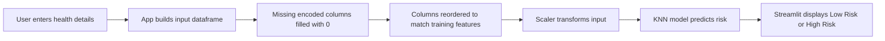

# Heart Disease Prediction Projects

<div align="center">


### Predict heart disease risk from clinical inputs using a Streamlit app powered by a trained KNN model.

</div>

## Overview

This project is a machine learning web app that estimates whether a user is at **low risk** or **high risk** of heart disease based on medical attributes such as age, cholesterol, resting blood pressure, ECG results, and exercise-related indicators.

The application uses:

- `Streamlit` for the interactive user interface
- `scikit-learn` for the K-Nearest Neighbors model
- `joblib` for loading the saved model, scaler, and feature columns
- `pandas` for preparing prediction input data

## Why This Project Stands Out

- Clean and simple prediction flow for non-technical users
- Real-time inference from a browser interface
- Preprocessing-aware prediction pipeline using saved scaler and feature columns
- Good beginner-friendly example of turning an ML model into a usable app
- Portfolio-ready project for data science and machine learning showcases

## App Workflow



## Input Features

The app collects the following details from the user:

| Feature | Description |
| --- | --- |
| `Age` | Age of the patient |
| `Sex` | Male or Female |
| `Chest Pain Type` | ATA, NAP, TA, or ASY |
| `RestingBP` | Resting blood pressure in mm Hg |
| `Cholesterol` | Serum cholesterol in mg/dL |
| `FastingBS` | Fasting blood sugar above 120 mg/dL |
| `RestingECG` | Normal, ST, or LVH |
| `MaxHR` | Maximum heart rate achieved |
| `ExerciseAngina` | Exercise-induced angina |
| `Oldpeak` | ST depression value |
| `ST_Slope` | Up, Flat, or Down |

## Tech Stack

| Category | Tools |
| --- | --- |
| Language | Python |
| App Framework | Streamlit |
| ML Library | scikit-learn |
| Data Handling | pandas, numpy |
| Model Storage | joblib |

## Project Structure

```text
Heart-Disease-Prediction-Projects/
├── app.py                 # Streamlit application
├── knn_heart_model.pkl    # Trained KNN model
├── heart_scaler.pkl       # Saved scaler for numeric features
├── heart_columns.pkl      # Expected encoded feature columns
├── requirements.txt       # Project dependencies
└── README.md              # Project documentation
```

## Quick Start

### 1. Clone the repository

```bash
git clone https://github.com/sumitjadhav1703/Heart-Disease-Prediction-Projects.git
cd Heart-Disease-Prediction-Projects
```

### 2. Install dependencies

```bash
pip install -r requirements.txt
```

### 3. Run the app

```bash
streamlit run app.py
```

## Prediction Logic

When the user clicks `Predict`, the application:

1. Reads all user inputs from the form
2. Creates a dataframe for a single prediction row
3. Applies one-hot style feature alignment using the saved training columns
4. Scales the input with the saved scaler
5. Sends the transformed data to the trained KNN model
6. Displays the final result in the UI

## Output

- `High Risk of Heart Disease`
- `Low Risk of Heart Disease`

The result is shown immediately inside the Streamlit app, which makes the project easy to demo during interviews, project reviews, or portfolio presentations.

<details>
<summary><strong>Model Notes</strong></summary>

- Algorithm used: `K-Nearest Neighbors (KNN)`
- Prediction depends on the saved files:
  - `knn_heart_model.pkl`
  - `heart_scaler.pkl`
  - `heart_columns.pkl`
- The app aligns user input to the same feature structure used during training

</details>

<details>
<summary><strong>Possible Future Improvements</strong></summary>

- Add probability scores or confidence indicators
- Compare multiple models such as Logistic Regression, Random Forest, and XGBoost
- Deploy the app on Streamlit Community Cloud
- Add charts or health-metric explanations for better user understanding
- Include screenshots or a live demo badge

</details>

<details>
<summary><strong>Best Use Cases</strong></summary>

- Machine learning mini-project showcase
- Streamlit deployment practice
- Resume or portfolio project for data science roles
- Beginner-friendly reference for ML model integration in web apps

</details>

## Author

**Sumit Jadhav**  
B.Tech AI & Data Science Student

If you found this project useful, consider starring the repository.
